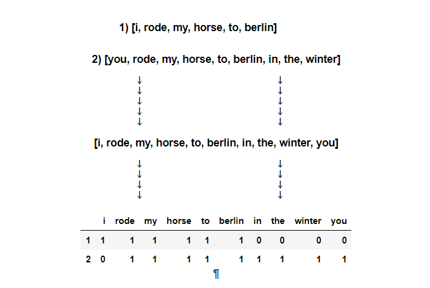

# Predicting-the-Upvotes

By using the datasets of `Hacker News` community this model which predicts the article popularity according to their experience by using its headline. Just by headline anyone will know what type of articles are trending in the `Hacker News`. This model uses the build in algorithm like `Linear Regression` and `RandomForestRegression`.

Missing Markdown between line 6 and 7 is here:-

For more info go through the `.ipynb` file.

